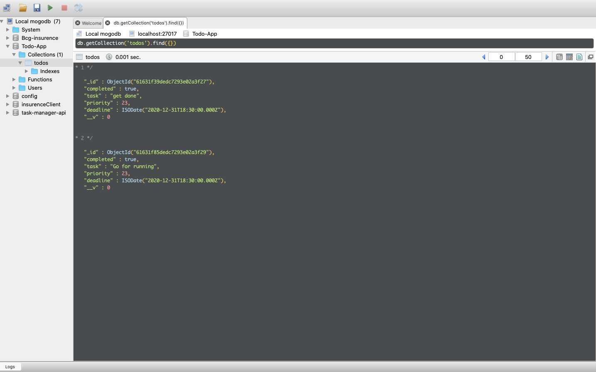

Backend server is built on Node.js and expresee framework is used in development of server.
For storing the data MongoDB is used

How to set up and Run the serve
   1. Clone the project on your local machine.
   2. Run npm install to install all the libraries
   3. Run the server using: node src/index.js
   
Base URL: 'http://localhost:3000'

Important APIs Provided by the server
 1. API for getting all the todo list
    GET '/todos'
 2. API for creating the new todo
    POST '/todos'
 3. API to update the todo
    PATCH '/todos/:id'
 4. API to delete the todo
    DELETE '/todos/:id'

Screenshot showing the todos collection in the MongoDB

